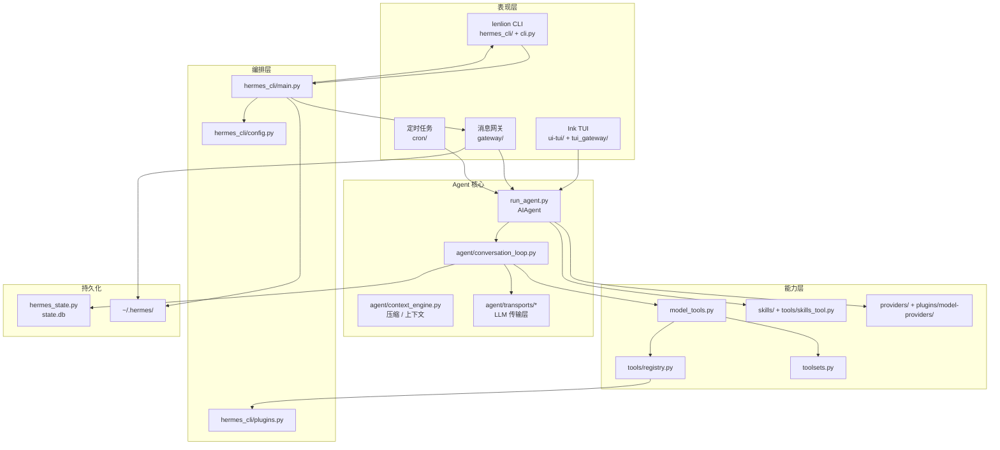
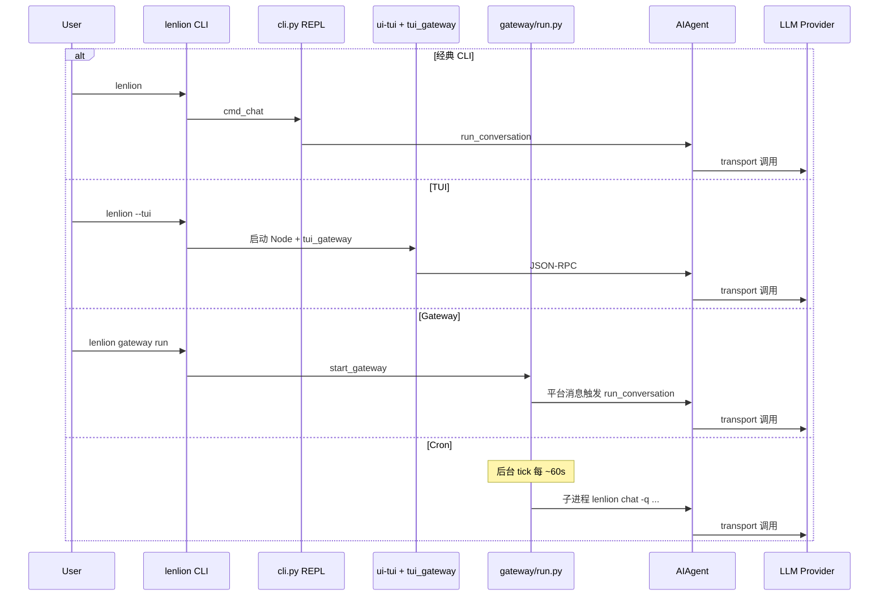

# Lenlion Agent 架构说明

本文档描述 `lenlion-project` 中 **Lenlion Agent**（`lenlion_agent/`）的整体架构。该项目基于 [Hermes Agent](https://github.com/NousResearch/hermes-agent) 核心运行时 fork，CLI 命令为 `lenlion`，用户数据目录仍为 `~/.hermes/`。

---

## 1. 架构概览

Lenlion Agent 是一个 **可插拔、多入口、多平台** 的 AI Agent 运行时，核心设计思路：

| 原则 | 说明 |
|------|------|
| **单一 Agent 核心** | 所有交互模式（CLI、Gateway、TUI、Cron）最终都调用 `AIAgent.run_conversation()` |
| **注册表驱动** | 工具（Tools）、插件（Plugins）、模型提供方（Providers）通过注册/发现机制扩展，而非硬编码 |
| **分层解耦** | CLI 编排、对话循环、工具执行、平台适配、持久化各自独立模块 |
| **配置集中** | `~/.hermes/config.yaml` + `.env` 统一管理；Profile 支持多实例隔离 |
| **渐进式能力加载** | 可选依赖通过 `extras` + `lazy_deps` 按需安装，减小默认安装体积 |

### 1.1 逻辑分层



---

## 2. 仓库与目录结构

```
lenlion-project/
├── ARCHITECTURE.md          # 本文档
├── README.md                # Monorepo 入口
├── .github/                 # CI（working-directory: lenlion_agent）
└── lenlion_agent/           # 独立 Agent 项目根
    ├── lenlion              # 开发用 CLI 启动脚本
    ├── run_agent.py         # AIAgent 主类 + lenlion-agent 入口
    ├── cli.py               # 经典 prompt_toolkit 交互 REPL
    ├── model_tools.py       # 工具编排公共 API
    ├── toolsets.py          # 工具集定义与组合
    ├── hermes_constants.py  # 全局常量（CLI 名、HERMES_HOME 等）
    ├── hermes_state.py      # SQLite 会话持久化
    ├── hermes_cli/          # CLI 子命令、配置、Setup、Gateway 封装
    ├── agent/               # 对话循环、上下文、Transport、Memory 等
    ├── tools/               # 各工具实现（registry.register）
    ├── gateway/             # 多平台消息网关
    ├── tui_gateway/         # TUI Python JSON-RPC 后端
    ├── ui-tui/              # Ink/React TUI 前端（TypeScript）
    ├── cron/                # 定时任务存储与调度
    ├── plugins/             # 内置插件（Provider、Memory、Platform 等）
    ├── providers/           # ProviderProfile 抽象与注册
    ├── skills/              # 内置技能包（SKILL.md）
    ├── locales/             # 多语言静态文案
    ├── optional-mcps/       # 可选 MCP 目录清单
    └── tests/               # Pytest 测试
```

**未迁移模块**（见 `lenlion_agent/MIGRATION.md`）：`website/`、`web/` Dashboard SPA、`apps/desktop/`、`docker/`、`acp_adapter/` 等。

---

## 3. 入口与运行模式

### 3.1 安装入口（`pyproject.toml`）

| 命令 | 模块 | 用途 |
|------|------|------|
| `lenlion` | `hermes_cli.main:main` | 主 CLI：chat、gateway、cron、setup、doctor 等 |
| `lenlion-agent` | `run_agent:main` | 独立 Agent 运行器（库 API + Fire CLI） |

### 3.2 CLI 路由（`hermes_cli/main.py`）

1. **Bootstrap**：`hermes_bootstrap`（Windows UTF-8）、进程标题、更新中断恢复
2. **Argparse**：`hermes_cli/_parser.py` 构建顶层解析器（`prog=lenlion`）
3. **默认行为**：无子命令 → `cmd_chat` → 交互式对话
4. **主要子命令**（部分）：

| 子命令 | 职责 |
|--------|------|
| `chat`（默认） | 经典 REPL 或 `--tui` 启动 TUI |
| `gateway` | 启动/管理消息网关进程 |
| `cron` | 定时任务 CRUD |
| `setup` / `model` / `auth` | 配置向导与模型/凭证管理 |
| `skills` / `tools` / `mcp` | 技能、工具集、MCP 管理 |
| `plugins` | 插件发现与管理 |
| `doctor` / `debug` | 诊断与调试报告 |

### 3.3 四种典型运行模式



---

## 4. Agent 核心

### 4.1 `AIAgent`（`run_agent.py`）

`AIAgent` 是对外统一门面，职责包括：

- 初始化 Provider 客户端与 Transport
- 解析 `config.yaml` 中的 model / provider / toolsets
- 组装 system prompt（含 skills、memory、规则文件）
- 将 `run_conversation()` 委托给 `agent/conversation_loop.py`

### 4.2 对话循环（`agent/conversation_loop.py`）

单轮用户输入的处理流程（简化）：

```
用户消息
  → 构建 TurnContext（模型、工具集、会话状态）
  → LLM 调用（经 Transport + Provider Profile）
  → 若返回 tool_calls → tool_executor 执行 → 结果回填 messages
  → 循环直至模型给出最终文本或无 tool_calls
  → 上下文压缩（超 token 阈值时）
  → 后置钩子（memory 写入、curator 提示等）
  → 持久化到 state.db
```

关键协作模块：

| 模块 | 作用 |
|------|------|
| `agent/transports/*` | 统一不同 API 形态（OpenAI Chat、Anthropic Messages、Bedrock、Codex 等） |
| `agent/chat_completion_helpers.py` | Transport 调度与重试 |
| `agent/context_engine.py` | 可插拔上下文引擎（默认 compressor） |
| `agent/conversation_compression.py` | 历史压缩、图片缩小、会话分裂 |
| `agent/tool_executor.py` | 工具并行/串行执行 |
| `agent/memory_manager.py` | Memory 插件上下文注入 |
| `agent/error_classifier.py` | API 错误分类与 failover |
| `agent/turn_retry_state.py` | 单轮重试状态机 |

### 4.3 LLM Provider 架构

```
config.yaml (provider, model)
       ↓
plugins/model-providers/<name>/   ← ProviderProfile 插件
       ↓
providers/base.py                 ← 抽象接口（prepare_messages, fetch_models…）
       ↓
agent/transports/<api_mode>.py    ← 实际 HTTP/API 调用
       ↓
NormalizedResponse                ← 统一响应结构
```

Provider 以 **插件** 形式存在于 `plugins/model-providers/`，`providers/` 目录仅含 ABC 与注册逻辑。

---

## 5. 工具系统（Tools）

### 5.1 三层结构

```
toolsets.py          命名工具组（hermes-cli、research、full_stack…）
      ↓
model_tools.py       对外 API：get_tool_definitions / handle_function_call
      ↓
tools/registry.py    中央注册表：schema + handler + toolset 成员关系
      ↓
tools/*.py           各工具实现（terminal、file、browser、web_search…）
```

### 5.2 工具注册机制

每个工具文件在模块顶层调用 `registry.register()`，声明：

- OpenAI 格式 `schema`（name、description、parameters）
- `handler`（同步或 async  Callable）
- 所属 `toolsets`
- 可选 `check_fn`（环境/配置不满足时隐藏工具）

`model_tools.py` 导入时通过 AST 扫描 `tools/` 目录完成 **自动发现**，避免维护手工 import 列表。

### 5.3 工具调用链

```
conversation_loop
  → run_agent.handle_function_call (薄封装)
  → model_tools.handle_function_call
  → plugins pre_tool_call 钩子
  → tools/registry.dispatch
  → agent/tool_executor
  → plugins post_tool_call 钩子
```

### 5.4 工具集（Toolsets）

`toolsets.py` 定义逻辑分组，例如：

- **`hermes-cli`**：终端 CLI 默认工具集
- **平台专用集**：`hermes-telegram`、`hermes-discord` 等（Gateway 按平台启用）
- **组合集**：`research`、`full_stack` 等

Gateway 与 CLI 通过 `enabled_toolsets` / `disabled_toolsets` 配置差异化启用。

---

## 6. 消息网关（Gateway）

### 6.1 职责

`gateway/run.py` 中的 `GatewayRunner` 是长期运行的守护进程，负责：

- 加载并启动各 **PlatformAdapter**（Telegram、Slack、Matrix、飞书等）
- 将 inbound 消息路由到对应 `session_key`
- 维护 **AIAgent 实例缓存**（同会话复用 Agent，利于 Prompt Cache）
- 后台线程执行 **cron tick**（约 60 秒一次）
- 处理 Slash 命令（`/stop`、`/new`、技能命令等）

### 6.2 平台适配器

| 位置 | 内容 |
|------|------|
| `gateway/platforms/` | 内置适配器（telegram、slack、matrix、feishu、wecom…） |
| `plugins/platforms/` | 插件化平台（IRC、Line、Teams、Google Chat…） |
| `gateway/platforms/base.py` | `PlatformAdapter` 基类：消息收发、会话隔离、Markdown 渲染 |

### 6.3 消息流

```
平台 Webhook / Long Poll
  → PlatformAdapter.handle_message(event)
  → 解析 session_key（platform + chat_type + chat_id）
  → Slash 命令短路 / 鉴权 / pairing 检查
  → GatewayRunner → AIAgent.run_conversation()
  → 回复格式化（Markdown → HTML 等）→ 平台 API 发送
```

插件钩子 `pre_gateway_dispatch` 可在鉴权前拦截或改写消息。

---

## 7. 插件系统（Plugins）

### 7.1 发现顺序

1. 仓库内置 `plugins/<name>/`
2. 用户目录 `~/.hermes/plugins/<name>/`
3. 项目本地 `./.hermes/plugins/`（需 `HERMES_ENABLE_PROJECT_PLUGINS`）
4. Pip entry point 组 `hermes_agent.plugins`

### 7.2 插件契约

每个插件目录包含：

- **`plugin.yaml`**：元数据、依赖、CLI 子命令声明
- **`__init__.py`**：实现 `register(ctx: PluginContext)`

`PluginContext` 提供：

- `register_tool()` → 注册到 `tools/registry`
- `register_hook()` → 挂载生命周期钩子
- `register_cli_command()` → 动态 CLI 子命令

### 7.3 内置插件分类

| 类别 | 示例路径 |
|------|----------|
| 模型提供方 | `plugins/model-providers/openrouter/` |
| 记忆后端 | `plugins/memory/honcho/`、`mem0/`、`hindsight/` |
| 消息平台 | `plugins/platforms/discord/`、`teams/` |
| 图像/视频 | `plugins/image_gen/`、`video_gen/` |
| 可观测性 | `plugins/observability/langfuse/` |
| 上下文引擎 | `plugins/context_engine/` |

---

## 8. 技能系统（Skills）

### 8.1 技能是什么

技能是 **带 YAML frontmatter 的 Markdown 文档**（`SKILL.md`），描述特定任务的工作流、约束与示例。Agent 通过工具渐进式加载，而非一次性塞进 system prompt。

### 8.2 发现路径（优先级从高到低）

1. 仓库内置 `skills/`
2. `~/.hermes/skills/`
3. `~/.hermes/optional-skills/`
4. Profile / 项目本地路径（见 `agent/skill_utils.py`）

### 8.3 使用方式

| 方式 | 机制 |
|------|------|
| 斜杠命令 | `/skill-name` → `agent/skill_commands.py` |
| 工具调用 | `skills_list` / `skill_view`（`tools/skills_tool.py`） |
| 预加载 | CLI `--skills` 或 config 注入 system prompt |
| Cron 任务 | `jobs.json` 中指定 `skills` 列表 |
| Skill Bundle | `~/.hermes/skill-bundles/*.yaml` |

Frontmatter 中 `metadata.hermes` 为结构化扩展字段（tags、config 声明、blueprint 等），与 CLI 命令名 `lenlion` 无关。

---

## 9. 配置与持久化

### 9.1 用户数据目录（`~/.hermes/`）

| 路径 | 用途 |
|------|------|
| `config.yaml` | 主配置（model、gateway、display、toolsets…） |
| `.env` | API Key 与密钥 |
| `state.db` | SQLite 会话与消息（WAL 模式、FTS5 搜索） |
| `sessions/` | 部分遗留/辅助会话数据 |
| `skills/`、`plugins/` | 用户扩展 |
| `cron/jobs.json` | 定时任务定义 |
| `profiles/<name>/` | 多 Profile 隔离实例 |
| `logs/` | `agent.log`、`gateway.log` 等 |

目录解析：`hermes_constants.get_hermes_home()`，可通过 `HERMES_HOME` 覆盖。

### 9.2 配置加载

- **`hermes_cli/config.py`**：`DEFAULT_CONFIG` + 用户 YAML 深度合并
- **Profile**：`lenlion -p <name>` 在 argparse 之前改写 `HERMES_HOME`
- **Safe Mode**：`lenlion --safe-mode` 跳过用户 config、rules、plugins

### 9.3 会话持久化（`hermes_state.py`）

- 替代早期 per-session JSONL 文件
- 支持 CLI / Gateway / TUI 等不同 `source` 标签
- 压缩后通过 `parent_session_id` 建立会话 lineage
- Batch / RL 轨迹走独立系统，不入 `state.db`

---

## 10. 定时任务（Cron）

| 组件 | 文件 | 说明 |
|------|------|------|
| 任务存储 | `cron/jobs.py` | 读写 `~/.hermes/cron/jobs.json` |
| 调度器 | `cron/scheduler.py` | `tick()`：文件锁 + 到期任务 spawn 子进程 |
| CLI | `hermes_cli/cron.py` | `lenlion cron list/add/...` |
| 触发点 | `gateway/run.py` | Gateway 后台线程每 ~60s 调用 `tick()` |

Cron 触发的 Agent 子进程通常禁用 `cronjob`、`messaging`、`clarify` 等工具集，避免递归调度。

---

## 11. TUI 终端界面

```
ui-tui/ (TypeScript, Ink/React)
    │  JSON-RPC over stdio
    ▼
tui_gateway/ (Python)
    │  复用 AIAgent + cli 等价会话逻辑
    ▼
run_agent.py
```

- 启动：`lenlion --tui` 或 config 中 `display.interface: tui`
- 后端：`tui_gateway/server.py` 处理 session、消息、工具事件流
- 前端构建产物打包在 `hermes_cli/tui_dist/`（wheel package-data）

---

## 12. 依赖与打包策略

- **包管理**：`uv` + `pyproject.toml` + 精确 pin 的 `uv.lock`
- **核心依赖**：`openai`、`httpx`、`pydantic`、`prompt_toolkit`、`croniter`、`fastapi` 等
- **可选 extras**：`messaging`、`matrix`、`mcp`、`web`、`google`、`voice` 等
- **Lazy install**：搜索、TTS、部分 Provider 通过 `tools/lazy_deps.py` 首次使用时安装
- **`[all]` extra**：仅包含无法 lazy-install 的包（见 `pyproject.toml` 注释策略）

Python 版本要求：`>=3.11,<3.14`

---

## 13. 扩展点汇总

| 扩展类型 | 做法 | 关键文件 |
|----------|------|----------|
| 新工具 | 新增 `tools/my_tool.py` 并 `registry.register()` | `tools/registry.py` |
| 新工具集 | 编辑 `toolsets.py` | `toolsets.py` |
| 新插件 | `~/.hermes/plugins/` 或 `plugins/` + `plugin.yaml` | `hermes_cli/plugins.py` |
| 新 Provider | `plugins/model-providers/<name>/` | `providers/README.md` |
| 新 Memory 后端 | `plugins/memory/<backend>/` | config 中选择 backend |
| 新消息平台 | `gateway/platforms/` 或 `plugins/platforms/` | `ADDING_A_PLATFORM.md` |
| 新技能 | 目录 + `SKILL.md` 放入 `~/.hermes/skills/` | `tools/skills_tool.py` |
| MCP 服务 | config + `optional-mcps/` 清单 | `hermes_cli/mcp_catalog.py` |
| 项目规则 | 工作区 `AGENTS.md`、`SOUL.md` | 自动注入 system prompt |
| 钩子 | Plugin `register_hook` | `VALID_HOOKS` in `plugins.py` |

常用钩子：`pre_tool_call`、`post_tool_call`、`pre_llm_call`、`on_session_start`、`pre_gateway_dispatch`。

---

## 14. Lenlion 定制说明

相对上游 Hermes Agent，本 fork 的架构层差异较小，主要是 **产品化与仓库组织**：

| 项 | 说明 |
|----|------|
| CLI 命令 | `lenlion`（原 `hermes`） |
| PyPI 包名 | `lenlion-agent` |
| 代码位置 | Monorepo 下 `lenlion_agent/` 子目录 |
| 配置兼容 | 仍使用 `~/.hermes/`，无需迁移用户数据 |
| 未迁移模块 | 文档站、Desktop App、Dashboard Web、Docker/Nix 打包等 |
| CI | 根目录 `.github/`，`working-directory: lenlion_agent` |

架构本身（Agent 核心、Gateway、Tools、Plugins、Skills）与上游 Hermes 保持一致，便于后续 rsync 增量同步核心目录。

---

## 15. 关键文件索引

| 关注点 | 文件 |
|--------|------|
| CLI 路由 | `lenlion_agent/hermes_cli/main.py` |
| CLI 解析器 | `lenlion_agent/hermes_cli/_parser.py` |
| 交互 REPL | `lenlion_agent/cli.py` |
| Agent 门面 | `lenlion_agent/run_agent.py` |
| 对话循环 | `lenlion_agent/agent/conversation_loop.py` |
| 工具 API | `lenlion_agent/model_tools.py` |
| 工具注册 | `lenlion_agent/tools/registry.py` |
| 工具集 | `lenlion_agent/toolsets.py` |
| 网关守护 | `lenlion_agent/gateway/run.py` |
| 平台基类 | `lenlion_agent/gateway/platforms/base.py` |
| 插件管理 | `lenlion_agent/hermes_cli/plugins.py` |
| 配置 | `lenlion_agent/hermes_cli/config.py` |
| 常量 / HOME | `lenlion_agent/hermes_constants.py` |
| 会话 DB | `lenlion_agent/hermes_state.py` |
| Cron 调度 | `lenlion_agent/cron/scheduler.py` |
| TUI 后端 | `lenlion_agent/tui_gateway/server.py` |
| 打包 | `lenlion_agent/pyproject.toml` |
| 迁移范围 | `lenlion_agent/MIGRATION.md` |

---

## 16. 进一步阅读

- [lenlion_agent/README.md](./lenlion_agent/README.md) — 快速开始
- [lenlion_agent/MIGRATION.md](./lenlion_agent/MIGRATION.md) — 迁移与定制记录
- [lenlion_agent/AGENTS.md](./lenlion_agent/AGENTS.md) — 开发者贡献指南（上游风格）
- [lenlion_agent/gateway/platforms/ADDING_A_PLATFORM.md](./lenlion_agent/gateway/platforms/ADDING_A_PLATFORM.md) — 新增消息平台
- [lenlion_agent/README.hermes-upstream.md](./lenlion_agent/README.hermes-upstream.md) — 上游完整功能文档
