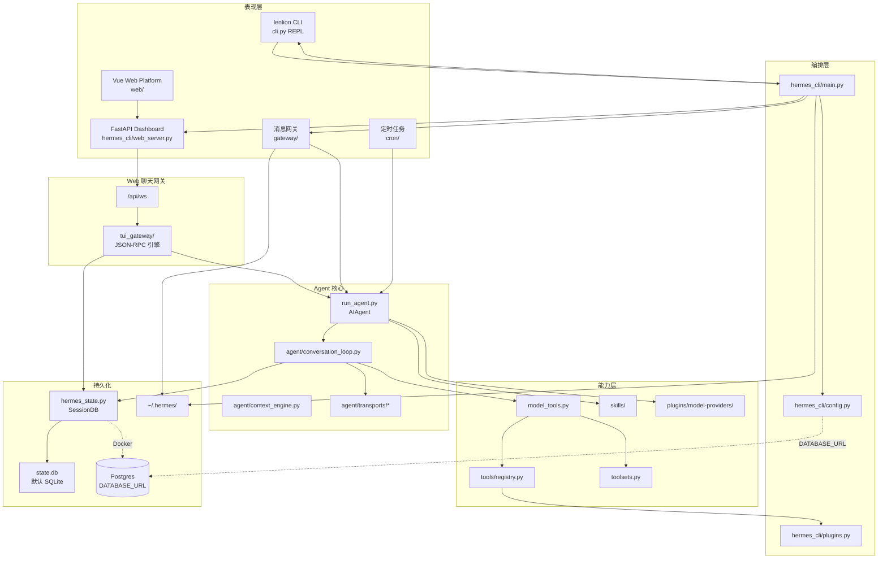
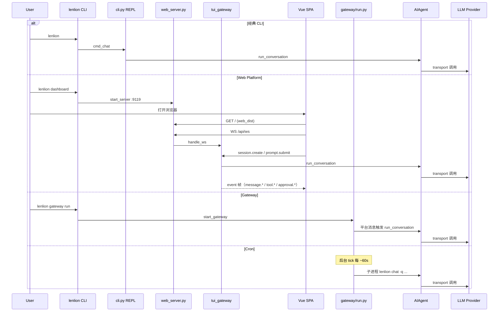
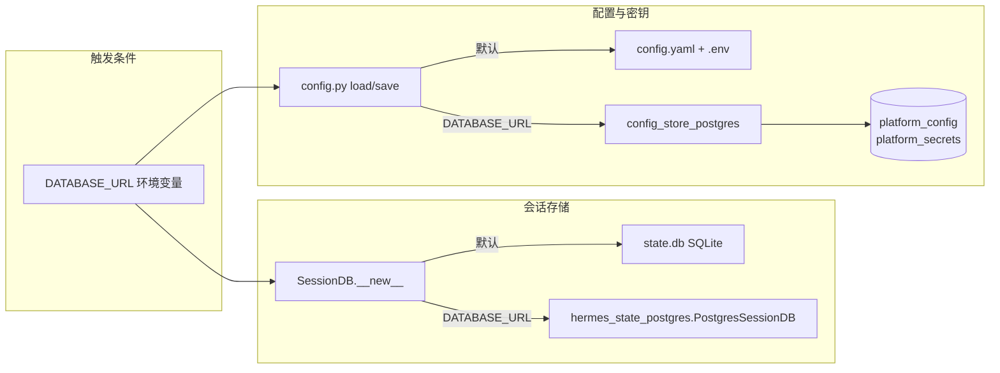

# Lenlion Agent 架构说明

本文档描述 `lenlion-project` 中 **Lenlion Agent**（`lenlion_agent/`）的整体架构。该项目基于 [Hermes Agent](https://github.com/NousResearch/hermes-agent) 核心运行时 fork，CLI 命令为 `lenlion`，用户数据目录仍为 `~/.hermes/`。

---

## 1. 架构概览

Lenlion Agent 是一个 **可插拔、多入口、多平台** 的 AI Agent 运行时，核心设计思路：

| 原则 | 说明 |
|------|------|
| **单一 Agent 核心** | 所有交互模式（CLI、Web Chat、Gateway、Cron）最终都调用 `AIAgent.run_conversation()` |
| **注册表驱动** | 工具（Tools）、插件（Plugins）、模型提供方（Providers）通过注册/发现机制扩展，而非硬编码 |
| **分层解耦** | CLI 编排、对话循环、工具执行、平台适配、持久化各自独立模块 |
| **配置集中** | 默认 `~/.hermes/config.yaml` + `.env`；Docker 下可经 `DATABASE_URL` 存入 Postgres |
| **渐进式能力加载** | 可选依赖通过 `extras` + `lazy_deps` 按需安装，减小默认安装体积 |

### 1.1 逻辑分层



---

## 2. 仓库与目录结构

```
lenlion-project/
├── ARCHITECTURE.md          # 本文档
├── README.md                # Monorepo 入口
├── .github/                 # CI（working-directory: lenlion_agent）
└── lenlion_agent/           # 独立 Agent 项目根
    ├── DOCKER.md            # Docker 部署与运维
    ├── Dockerfile
    ├── docker-compose.yml   # dashboard + gateway + postgres
    ├── docker/postgres/     # Postgres 初始化 schema
    ├── lenlion              # 开发用 CLI 启动脚本
    ├── run_agent.py         # AIAgent 主类 + lenlion-agent 入口
    ├── cli.py               # 经典 prompt_toolkit 交互 REPL
    ├── model_tools.py       # 工具编排公共 API
    ├── toolsets.py          # 工具集定义与组合
    ├── hermes_constants.py  # 全局常量（CLI 名、HERMES_HOME 等）
    ├── hermes_state.py      # 会话持久化（SQLite 默认；DATABASE_URL → Postgres）
    ├── hermes_state_postgres.py  # Postgres 会话后端
    ├── hermes_cli/          # CLI 子命令、FastAPI Dashboard、web_dist/
    │   ├── config.py        # 配置加载/保存（文件或 Postgres）
    │   ├── config_store_postgres.py
    │   ├── env_i18n.py      # 密钥页中文说明
    │   └── web_server.py    # FastAPI + REST /api/*
    ├── agent/               # 对话循环、上下文、Transport、Memory 等
    ├── tools/               # 各工具实现（registry.register）
    ├── gateway/             # 多平台消息网关
    ├── web/                 # Vue 3 平台前端（侧栏 + 12 视图）
    ├── tui_gateway/         # WebSocket JSON-RPC 聊天后端引擎（非终端 UI）
    ├── cron/                # 定时任务存储与调度
    ├── plugins/             # 内置插件（Provider、Memory、Platform 等）
    ├── providers/           # ProviderProfile 抽象与注册
    ├── skills/              # 内置技能包（SKILL.md）
    ├── locales/             # 多语言静态文案
    ├── scripts/             # 开发与部署脚本（含 deploy-docker.sh）
    ├── optional-mcps/       # 可选 MCP 目录清单
    └── tests/               # Pytest 测试
```

**相对上游 Hermes 已移除**：Ink TUI（`ui-tui/`）、PTY 嵌入层（`/api/pty`）、`lenlion --tui`。

**未迁移模块**（见 `lenlion_agent/MIGRATION.md`）：文档站、Electron 桌面端、上游全功能 React Dashboard、上游 s6-overlay 全功能 Docker/Nix 打包、`acp_adapter/` 等（本 fork 提供精简 Docker，见 `lenlion_agent/DOCKER.md`）。

---

## 3. 入口与运行模式

### 3.1 安装入口（`pyproject.toml`）

| 命令 | 模块 | 用途 |
|------|------|------|
| `lenlion` | `hermes_cli.main:main` | 主 CLI：chat、dashboard、gateway、cron、setup、doctor 等 |
| `lenlion-agent` | `run_agent:main` | 独立 Agent 运行器（库 API + Fire CLI） |

### 3.2 CLI 路由（`hermes_cli/main.py`）

1. **Bootstrap**：`hermes_bootstrap`（Windows UTF-8）、进程标题、更新中断恢复
2. **Argparse**：`hermes_cli/_parser.py` 构建顶层解析器（`prog=lenlion`）
3. **默认行为**：无子命令 → `cmd_chat` → 经典 prompt_toolkit REPL
4. **主要子命令**（部分）：

| 子命令 | 职责 |
|--------|------|
| `chat`（默认） | 经典 REPL 交互对话 |
| `dashboard` | 启动 FastAPI Web 服务 + Vue 平台界面 |
| `gateway` | 启动/管理消息网关进程 |
| `cron` | 定时任务 CRUD |
| `setup` / `model` / `auth` | 配置向导与模型/凭证管理 |
| `skills` / `tools` / `mcp` | 技能、工具集、MCP 管理 |
| `plugins` | 插件发现与管理 |
| `doctor` / `debug` | 诊断与调试报告 |

### 3.3 四种典型运行模式



---

## 4. Agent 核心

### 4.1 `AIAgent`（`run_agent.py`）

`AIAgent` 是对外统一门面，职责包括：

- 初始化 Provider 客户端与 Transport
- 解析 `config.yaml` 中的 model / provider / toolsets
- 组装 system prompt（含 skills、memory、规则文件）
- 将 `run_conversation()` 委托给 `agent/conversation_loop.py`

### 4.2 对话循环（`agent/conversation_loop.py`）

单轮用户输入的处理流程（简化）：

```
用户消息
  → build_turn_context（TurnContext、压缩预检、pre_llm_call 钩子）
  → LLM 调用（经 Transport + Provider Profile）
  → 若返回 tool_calls → tool_executor 执行 → 结果回填 messages
  → 循环直至模型给出最终文本或无 tool_calls
  → 上下文压缩（超 token 阈值时）
  → 后置钩子（memory 写入、curator 提示等）
  → 持久化到 SessionDB（SQLite 或 Postgres）
```

关键协作模块：

| 模块 | 作用 |
|------|------|
| `agent/transports/*` | 统一不同 API 形态（OpenAI Chat、Anthropic Messages、Bedrock、Codex 等） |
| `agent/chat_completion_helpers.py` | Transport 调度与重试 |
| `agent/context_engine.py` | 可插拔上下文引擎（默认 compressor） |
| `agent/conversation_compression.py` | 历史压缩、图片缩小、会话分裂 |
| `agent/tool_executor.py` | 工具并行/串行执行 |
| `agent/memory_manager.py` | Memory 插件上下文注入 |
| `agent/error_classifier.py` | API 错误分类与 failover |
| `agent/turn_retry_state.py` | 单轮重试状态机 |
| `agent/turn_context.py` | 单轮 setup（插件钩子、memory prefetch 等） |

### 4.3 LLM Provider 架构

```
config.yaml (provider, model)
       ↓
plugins/model-providers/<name>/   ← ProviderProfile 插件
       ↓
providers/base.py                 ← 抽象接口（prepare_messages, fetch_models…）
       ↓
agent/transports/<api_mode>.py    ← 实际 HTTP/API 调用
       ↓
NormalizedResponse                ← 统一响应结构
```

Provider 以 **插件** 形式存在于 `plugins/model-providers/`，`providers/` 目录仅含 ABC 与注册逻辑。

---

## 5. 工具系统（Tools）

### 5.1 三层结构

```
toolsets.py          命名工具组（hermes-cli、research、full_stack…）
      ↓
model_tools.py       对外 API：get_tool_definitions / handle_function_call
      ↓
tools/registry.py    中央注册表：schema + handler + toolset 成员关系
      ↓
tools/*.py           各工具实现（terminal、file、browser、web_search…）
```

### 5.2 工具注册机制

每个工具文件在模块顶层调用 `registry.register()`，声明：

- OpenAI 格式 `schema`（name、description、parameters）
- `handler`（同步或 async Callable）
- 所属 `toolsets`
- 可选 `check_fn`（环境/配置不满足时隐藏工具）

`model_tools.py` 导入时通过 AST 扫描 `tools/` 目录完成 **自动发现**，避免维护手工 import 列表。

### 5.3 工具调用链

```
conversation_loop
  → run_agent.handle_function_call (薄封装)
  → model_tools.handle_function_call
  → plugins pre_tool_call 钩子
  → tools/registry.dispatch
  → agent/tool_executor
  → plugins post_tool_call 钩子
```

### 5.4 工具集（Toolsets）

`toolsets.py` 定义逻辑分组，例如：

- **`hermes-cli`**：终端 CLI 默认工具集
- **平台专用集**：`hermes-telegram`、`hermes-discord` 等（Gateway 按平台启用）
- **组合集**：`research`、`full_stack` 等

Gateway 与 CLI 通过 `enabled_toolsets` / `disabled_toolsets` 配置差异化启用。

---

## 6. 消息网关（Gateway）

### 6.1 职责

`gateway/run.py` 中的 `GatewayRunner` 是长期运行的守护进程，负责：

- 加载并启动各 **PlatformAdapter**（Telegram、Slack、Matrix、飞书等）
- 将 inbound 消息路由到对应 `session_key`
- 维护 **AIAgent 实例缓存**（同会话复用 Agent，利于 Prompt Cache）
- 后台线程执行 **cron tick**（约 60 秒一次）
- 处理 Slash 命令（`/stop`、`/new`、技能命令等）

### 6.2 平台适配器

| 位置 | 内容 |
|------|------|
| `gateway/platforms/` | 内置适配器（telegram、slack、matrix、feishu、wecom…） |
| `plugins/platforms/` | 插件化平台（IRC、Line、Teams、Google Chat…） |
| `gateway/platforms/base.py` | `PlatformAdapter` 基类：消息收发、会话隔离、Markdown 渲染 |

### 6.3 消息流

```
平台 Webhook / Long Poll
  → PlatformAdapter.handle_message(event)
  → 解析 session_key（platform + chat_type + chat_id）
  → Slash 命令短路 / 鉴权 / pairing 检查
  → GatewayRunner → AIAgent.run_conversation()
  → 回复格式化（Markdown → HTML 等）→ 平台 API 发送
```

插件钩子 `pre_gateway_dispatch` 可在鉴权前拦截或改写消息。

---

## 7. Web Platform 架构

Lenlion 的浏览器界面由 **Vue 平台 SPA + FastAPI Dashboard + tui_gateway JSON-RPC 引擎** 三部分组成。`tui_gateway` 名称来自上游 Hermes TUI 时代，在本 fork 中 **仅作为 Web 聊天后端**，不再驱动终端 UI。

### 7.1 组件职责

| 组件 | 路径 | 职责 |
|------|------|------|
| **Vue SPA** | `web/` | 侧栏平台 UI：概览、聊天、模型、配置、密钥、工具集、技能、MCP、网关、Cron、会话、日志 |
| **静态产物** | `hermes_cli/web_dist/` | `npm run build` 输出，打包进 wheel |
| **Dashboard 服务** | `hermes_cli/web_server.py` | FastAPI：serve SPA、`/api/ws`、REST 管理 API、OAuth 门控 |
| **聊天网关** | `tui_gateway/` | JSON-RPC 会话管理、Agent 构建、事件推送 |

### 7.2 前端结构

```
web/src/
├── App.vue                 # 侧栏壳 + 视图路由（Pinia nav）
├── components/layout/      # AppSidebar 等布局组件
├── views/                  # 12 个功能视图
│   ├── OverviewView.vue    # 概览 / doctor
│   ├── ChatView.vue        # 聊天（复用 MessageList、Composer 等）
│   ├── ModelView.vue       # 模型选择与切换
│   ├── ConfigView.vue      # config.yaml 编辑
│   ├── EnvView.vue         # API Key / 环境变量（中文说明）
│   ├── ToolsView.vue       # 工具集开关
│   ├── SkillsView.vue      # 技能列表
│   ├── McpView.vue         # MCP 服务
│   ├── GatewayView.vue     # 消息网关状态
│   ├── CronView.vue        # 定时任务
│   ├── SessionsView.vue    # 会话列表
│   └── LogsView.vue        # 运行日志
├── stores/
│   ├── app.ts              # 导航状态（nav、侧栏折叠）
│   └── chat.ts             # 聊天 WebSocket 事件状态
└── lib/
    ├── apiClient.ts        # REST `/api/*` 封装（管理页）
    └── gatewayClient.ts    # WebSocket JSON-RPC（聊天页）
```

导航由 `stores/app.ts` 的 `nav` 字段驱动，无 Vue Router；聊天与管理功能 **双通道通信**：

| 通道 | 客户端 | 协议 | 用途 |
|------|--------|------|------|
| **聊天** | `gatewayClient.ts` | WS `/api/ws` JSON-RPC | 会话创建、消息流、工具/审批/澄清事件 |
| **管理** | `apiClient.ts` | HTTP REST `/api/*` | 配置、密钥、模型、工具集、网关、Cron 等 |

### 7.3 启动与构建

```
lenlion dashboard
  → cmd_dashboard (main.py)
  → 可选 _build_web_ui(web/) — dist 过期时自动 npm build
  → start_background_mcp_discovery() — Dashboard 进程内启动 MCP 发现
  → web_server.start_server(host, port) — 默认 127.0.0.1:9119
```

Vite 配置（`web/vite.config.ts`）：

- `base: './'` — 支持子路径反向代理
- `outDir: '../hermes_cli/web_dist'` — 构建产物直接进入 Python 包
- 开发模式 `proxy /api → :9119` — 前后端联调

### 7.4 聊天通信协议（WebSocket）

**WebSocket `/api/ws`** — 与上游 stdio TUI 相同的 **换行分隔 JSON-RPC 2.0**：

```
Browser                          tui_gateway/server.py
   │                                      │
   │──── connect ────────────────────────►│
   │◄─── gateway.ready (event) ───────────│
   │──── session.create ─────────────────►│
   │◄─── result { session_id } ───────────│
   │──── prompt.submit { text } ─────────►│
   │◄─── event message.delta / tool.* ────│
   │◄─── event approval.request ──────────│  (需用户响应)
   │──── approval.respond ───────────────►│
```

前端封装（`web/src/lib/gatewayClient.ts`）：

- 连接时携带 `?token=`（loopback 模式）或 OAuth 模式下的 `?ticket=`
- 请求/响应通过 `id` 关联；服务端推送以 `method: "event"` 帧分发
- Pinia store（`web/src/stores/chat.ts`）订阅事件并驱动 UI 状态

主要 RPC 方法（`tui_gateway/server.py`）：

| 方法 | 用途 |
|------|------|
| `session.create` | 创建或恢复聊天会话 |
| `prompt.submit` | 提交用户消息，触发 Agent 回合 |
| `session.interrupt` | 中断进行中的生成 |
| `approval.respond` / `clarify.respond` / `secret.respond` | 交互式对话框响应 |

### 7.5 REST 管理 API（管理视图）

管理视图通过 `apiClient.ts` 调用 `web_server.py` 已有 REST 端点，写入经 `hermes_cli/config.py` 持久化（文件或 Postgres，见 §10）：

| 视图 | 主要端点 |
|------|----------|
| 概览 | `GET /api/status`、`POST /api/ops/doctor` |
| 模型 | `GET /api/model/info`、`POST /api/model/switch` |
| 配置 | `GET/PUT /api/config` |
| 密钥 | `GET/PUT /api/env?lang=zh` |
| 工具集 | `GET /api/tools/toolsets`、`PUT /api/tools/toolsets/{name}` |
| 技能 | `GET /api/skills`、`PUT /api/skills/toggle` |
| MCP | `GET /api/mcp/servers` |
| 网关 | `GET /api/messaging/platforms`、`POST /api/gateway/{action}` |
| Cron | `GET /api/cron/jobs` |
| 会话 | `GET /api/sessions` |
| 日志 | `GET /api/logs` |

密钥页中文说明：`GET /api/env?lang=zh` 时，`env_i18n.localize_env_description()` 从 `env_descriptions_zh.yaml` 覆盖英文描述；默认语言跟随 `display.language`（未设置时默认 `zh`）。

### 7.6 Agent 实例化

Dashboard 路径下 Agent 由 `tui_gateway.server._make_agent()` 构建，而非 REPL 的 `cli.py` 路径：

- 快照当前工具注册表（含 MCP 工具，需 dashboard 启动时后台 MCP 发现）
- 会话级 model / toolsets 覆盖
- 事件通过 `tui_gateway/event_publisher.py` 推送到 WebSocket 客户端

### 7.7 鉴权与安全

| 模式 | 机制 |
|------|------|
| **Loopback 默认** | 绑定 `127.0.0.1`；SPA 注入 `_SESSION_TOKEN`；WS 连接带 `?token=` |
| **OAuth 门控** | `dashboard_auth/` 中间件；公开路径白名单；WS 需先 REST 换取 ticket |
| **CORS** | 仅允许 `localhost` / `127.0.0.1` 来源 |

REST 与管理写操作同样受 loopback token 或 OAuth 门控保护；`apiClient.ts` 在请求头携带 `X-Hermes-Session-Token`。

### 7.8 与已移除 TUI 的关系

| 已移除 | 替代 |
|--------|------|
| `ui-tui/` Ink/React 终端 UI | `web/` Vue SPA |
| `/api/pty` PTY 嵌入 xterm.js | 结构化 `/api/ws` JSON-RPC |
| `lenlion --tui` | `lenlion dashboard` |
| `hermes_cli/tui_dist/` | `hermes_cli/web_dist/` |

---

## 8. 插件系统（Plugins）

### 8.1 发现顺序

1. 仓库内置 `plugins/<name>/`
2. 用户目录 `~/.hermes/plugins/<name>/`
3. 项目本地 `./.hermes/plugins/`（需 `HERMES_ENABLE_PROJECT_PLUGINS`）
4. Pip entry point 组 `hermes_agent.plugins`

### 8.2 插件契约

每个插件目录包含：

- **`plugin.yaml`**：元数据、依赖、CLI 子命令声明
- **`__init__.py`**：实现 `register(ctx: PluginContext)`

`PluginContext` 提供：

- `register_tool()` → 注册到 `tools/registry`
- `register_hook()` → 挂载生命周期钩子
- `register_cli_command()` → 动态 CLI 子命令

### 8.3 内置插件分类

| 类别 | 示例路径 |
|------|----------|
| 模型提供方 | `plugins/model-providers/openrouter/` |
| 记忆后端 | `plugins/memory/honcho/`、`mem0/`、`hindsight/` |
| 消息平台 | `plugins/platforms/discord/`、`teams/` |
| 图像/视频 | `plugins/image_gen/`、`video_gen/` |
| 可观测性 | `plugins/observability/langfuse/` |
| 上下文引擎 | `plugins/context_engine/` |

---

## 9. 技能系统（Skills）

### 9.1 技能是什么

技能是 **带 YAML frontmatter 的 Markdown 文档**（`SKILL.md`），描述特定任务的工作流、约束与示例。Agent 通过工具渐进式加载，而非一次性塞进 system prompt。

### 9.2 发现路径（优先级从高到低）

1. 仓库内置 `skills/`
2. `~/.hermes/skills/`
3. `~/.hermes/optional-skills/`
4. Profile / 项目本地路径（见 `agent/skill_utils.py`）

### 9.3 使用方式

| 方式 | 机制 |
|------|------|
| 斜杠命令 | `/skill-name` → `agent/skill_commands.py` |
| 工具调用 | `skills_list` / `skill_view`（`tools/skills_tool.py`） |
| 预加载 | CLI `--skills` 或 config 注入 system prompt |
| Cron 任务 | `jobs.json` 中指定 `skills` 列表 |
| Skill Bundle | `~/.hermes/skill-bundles/*.yaml` |

Frontmatter 中 `metadata.hermes` 为结构化扩展字段（tags、config 声明、blueprint 等）。

---

## 10. 配置与持久化

### 10.1 用户数据目录（`~/.hermes/`，或 Docker 中 `/data`）

| 路径 | 用途 |
|------|------|
| `config.yaml` | 主配置（model、gateway、display、toolsets…） |
| `.env` | API Key 与密钥 |
| `state.db` | SQLite 会话与消息（**本机默认**；设置 `DATABASE_URL` 后不再使用） |
| `sessions/` | 部分遗留/辅助会话数据 |
| `skills/`、`plugins/` | 用户扩展 |
| `cron/jobs.json` | 定时任务定义 |
| `profiles/<name>/` | 多 Profile 隔离实例 |
| `logs/` | `agent.log`、`gateway.log`、`tui_gateway_crash.log` 等 |

目录解析：`hermes_constants.get_hermes_home()`，可通过 `HERMES_HOME` 覆盖。Docker Compose 将 `HERMES_HOME=/data` 映射到命名卷 `lenlion-data`。

### 10.2 配置加载

- **`hermes_cli/config.py`**：`DEFAULT_CONFIG` + 用户 YAML 深度合并
- **Profile**：`lenlion -p <name>` 在 argparse 之前改写 `HERMES_HOME`
- **Safe Mode**：`lenlion --safe-mode` 跳过用户 config、rules、plugins

### 10.3 双后端持久化（文件 vs Postgres）

当环境变量 **`DATABASE_URL`** 存在时，运行时自动切换 Postgres 后端（Docker Compose 默认启用）：



| 数据 | 本机默认 | `DATABASE_URL` 设置后 |
|------|----------|----------------------|
| 会话与消息 | `state.db`（SQLite + FTS5） | Postgres `sessions` / `messages` 表 |
| `config.yaml` | `~/.hermes/config.yaml` | Postgres `platform_config`（按 `profile_id`） |
| `.env` 密钥 | `~/.hermes/.env` | Postgres `platform_secrets` |
| 技能、日志、缓存 | 文件系统 | 仍为 `/data` 卷（`HERMES_HOME`） |

实现要点：

- **`hermes_state.py`**：`SessionDB()` 经 `__new__` 委托给 `hermes_state_postgres`；Postgres 不可用时回退 SQLite
- **`hermes_cli/config_store_postgres.py`**：`load_config` / `save_config` / `load_env` / `save_env_value` 的 Postgres 实现
- **`docker/postgres/init.sql`**：容器首次启动时建表（schema 与 SQLite 版对齐，另含 `platform_config` / `platform_secrets`）
- **首次迁移**：DB 为空时，`config.py` 可从现有 `config.yaml` / `.env` 自动导入 Postgres

Web 平台前端保存配置或密钥后，dashboard / gateway 进程通过同一 `config.py` 读取，无需重启即可生效（有进程内缓存时以实际实现为准）。

### 10.4 会话持久化（`hermes_state.py`）

- 替代早期 per-session JSONL 文件
- 支持 CLI / Web / Gateway 等不同 `source` 标签
- 压缩后通过 `parent_session_id` 建立会话 lineage
- Batch / RL 轨迹走独立系统，不入主会话库
- Postgres 模式下全文搜索使用 `ILIKE` 回退（无 SQLite FTS5）

---

## 11. 定时任务（Cron）

| 组件 | 文件 | 说明 |
|------|------|------|
| 任务存储 | `cron/jobs.py` | 读写 `~/.hermes/cron/jobs.json` |
| 调度器 | `cron/scheduler.py` | `tick()`：文件锁 + 到期任务 spawn 子进程 |
| CLI | `hermes_cli/cron.py` | `lenlion cron list/add/...` |
| 触发点 | `gateway/run.py` | Gateway 后台线程每 ~60s 调用 `tick()` |

Cron 触发的 Agent 子进程通常禁用 `cronjob`、`messaging`、`clarify` 等工具集，避免递归调度。

---

## 12. 部署与打包

Lenlion 采用 **本地优先** 部署，同时提供 **Docker 容器** 与本机 **Python 包** 两种运行方式。详见 [lenlion_agent/DOCKER.md](./lenlion_agent/DOCKER.md)。

### 12.1 分发渠道

| 渠道 | 说明 |
|------|------|
| **PyPI** | 包名 `lenlion-agent`；CalVer tag 触发 `.github/workflows/upload_to_pypi.yml` |
| **Docker** | `lenlion_agent/Dockerfile` + `lenlion_agent/docker-compose.yml`；CI 见 `docker-build.yml` |
| **Editable 安装** | `pip install -e ".[cli,web,mcp,cron]"` |
| **install.sh** | `scripts/install.sh` — git clone + venv 一键安装（偏上游 Hermes 风格） |

### 12.2 Web UI 打包

```
web/  ──npm run build──►  hermes_cli/web_dist/  ──wheel package-data──►  PyPI
```

`lenlion dashboard` 从已安装包的 `web_dist/` serve 静态文件，无需单独部署前端 CDN。

### 12.3 运行时拓扑

```
┌─────────────────────────────────────────┐
│  lenlion dashboard (单进程)              │
│  ┌─────────────┐  ┌──────────────────┐  │
│  │ uvicorn     │  │ tui_gateway      │  │
│  │ FastAPI     │──│ (in-process WS)  │  │
│  │ + web_dist  │  └────────┬─────────┘  │
│  └─────────────┘           │            │
└────────────────────────────┼────────────┘
                             ▼
                        AIAgent → LLM API

lenlion gateway run  ──►  独立长期运行进程  ──►  AIAgent → 平台 API
```

对外暴露 Dashboard 时：反向代理 + TLS + OAuth 门控；**不建议** `--insecure` 裸绑 `0.0.0.0` 到公网。

### 12.4 Docker 容器部署

```
docker compose (lenlion_agent/)
    ├── postgres   → 会话 + platform_config + platform_secrets
    ├── dashboard  → lenlion dashboard  (:9119 → 127.0.0.1)
    └── gateway    → lenlion gateway run
              │
              ├── DATABASE_URL → postgres（共享会话与配置）
              └── lenlion-data 卷 → /data（技能、日志、缓存等文件）
```

- 镜像在构建阶段完成 `web/` → `hermes_cli/web_dist/` 与 `uv sync --frozen`
- Python 依赖需 `postgres` extra（`psycopg[binary]`，已编入 Docker 镜像）
- 一键脚本：`scripts/deploy-docker.sh`；完整运维见 [DOCKER.md](./lenlion_agent/DOCKER.md)

### 12.5 依赖策略

- **包管理**：`uv` + `pyproject.toml` + 精确 pin 的 `uv.lock`
- **核心依赖**：`openai`、`httpx`、`pydantic`、`prompt_toolkit`、`croniter`、`fastapi` 等
- **可选 extras**：`messaging`、`matrix`、`mcp`、`web`、`google`、`voice` 等
- **Lazy install**：搜索、TTS、部分 Provider 通过 `tools/lazy_deps.py` 首次使用时安装

Python 版本要求：`>=3.11,<3.14`

---

## 13. 扩展点汇总

| 扩展类型 | 做法 | 关键文件 |
|----------|------|----------|
| 新工具 | 新增 `tools/my_tool.py` 并 `registry.register()` | `tools/registry.py` |
| 新工具集 | 编辑 `toolsets.py` | `toolsets.py` |
| 新插件 | `~/.hermes/plugins/` 或 `plugins/` + `plugin.yaml` | `hermes_cli/plugins.py` |
| 新 Provider | `plugins/model-providers/<name>/` | `providers/README.md` |
| 新 Memory 后端 | `plugins/memory/<backend>/` | config 中选择 backend |
| 新消息平台 | `gateway/platforms/` 或 `plugins/platforms/` | `ADDING_A_PLATFORM.md` |
| 新技能 | 目录 + `SKILL.md` 放入 `~/.hermes/skills/` | `tools/skills_tool.py` |
| Web 平台 UI | 扩展 `web/src/views/` 或 `components/` | `apiClient.ts` / `gatewayClient.ts` |
| MCP 服务 | config + `optional-mcps/` 清单 | `hermes_cli/mcp_catalog.py` |
| 项目规则 | 工作区 `AGENTS.md`、`SOUL.md` | 自动注入 system prompt |
| 钩子 | Plugin `register_hook` | `VALID_HOOKS` in `plugins.py` |

常用钩子：`pre_tool_call`、`post_tool_call`、`pre_llm_call`、`on_session_start`、`pre_gateway_dispatch`。

---

## 14. Lenlion 定制说明

相对上游 Hermes Agent，本 fork 在架构层保持 Agent / Gateway / Tools / Plugins 核心不变，主要差异在 **交互入口与仓库组织**：

| 项 | 说明 |
|----|------|
| CLI 命令 | `lenlion`（原 `hermes`） |
| PyPI 包名 | `lenlion-agent` |
| 代码位置 | Monorepo 下 `lenlion_agent/` 子目录 |
| 配置兼容 | 仍使用 `~/.hermes/`；Docker 下配置/密钥可存 Postgres |
| Web 界面 | Vue 3 平台 SPA（侧栏 + 12 视图），替代 Ink TUI + PTY 嵌入 |
| 聊天后端 | 保留 `tui_gateway` JSON-RPC，经 `/api/ws` 暴露 |
| 持久化 | 本机 SQLite + 文件；Docker 可选 Postgres（`DATABASE_URL`） |
| 已移除 | TUI、`/api/pty`、上游 s6 Docker/Nix 打包、Desktop App、文档站 |
| 新增 | 精简 Docker 部署（`Dockerfile` + Compose + `DOCKER.md` + Postgres） |
| CI | 根目录 `.github/`，`working-directory: lenlion_agent` |

核心目录（`agent/`、`gateway/`、`tools/`、`plugins/`）可与上游 rsync 增量同步。

---

## 15. 关键文件索引

| 关注点 | 文件 |
|--------|------|
| CLI 路由 | `lenlion_agent/hermes_cli/main.py` |
| CLI 解析器 | `lenlion_agent/hermes_cli/_parser.py` |
| 交互 REPL | `lenlion_agent/cli.py` |
| Dashboard 服务 | `lenlion_agent/hermes_cli/web_server.py` |
| Dashboard 启动 | `cmd_dashboard` in `main.py` |
| Vue 入口 | `lenlion_agent/web/src/App.vue` |
| 平台导航 | `lenlion_agent/web/src/stores/app.ts` |
| REST 客户端 | `lenlion_agent/web/src/lib/apiClient.ts` |
| WS 客户端 | `lenlion_agent/web/src/lib/gatewayClient.ts` |
| 聊天状态 | `lenlion_agent/web/src/stores/chat.ts` |
| WS 服务端 | `lenlion_agent/tui_gateway/ws.py` |
| JSON-RPC 引擎 | `lenlion_agent/tui_gateway/server.py` |
| Agent 门面 | `lenlion_agent/run_agent.py` |
| 对话循环 | `lenlion_agent/agent/conversation_loop.py` |
| 工具 API | `lenlion_agent/model_tools.py` |
| 工具注册 | `lenlion_agent/tools/registry.py` |
| 工具集 | `lenlion_agent/toolsets.py` |
| 网关守护 | `lenlion_agent/gateway/run.py` |
| 平台基类 | `lenlion_agent/gateway/platforms/base.py` |
| 插件管理 | `lenlion_agent/hermes_cli/plugins.py` |
| 配置 | `lenlion_agent/hermes_cli/config.py` |
| Postgres 配置存储 | `lenlion_agent/hermes_cli/config_store_postgres.py` |
| 密钥中文说明 | `lenlion_agent/hermes_cli/env_i18n.py` |
| 常量 / HOME | `lenlion_agent/hermes_constants.py` |
| 会话 DB | `lenlion_agent/hermes_state.py` |
| Postgres 会话 DB | `lenlion_agent/hermes_state_postgres.py` |
| Postgres schema | `lenlion_agent/docker/postgres/init.sql` |
| Cron 调度 | `lenlion_agent/cron/scheduler.py` |
| Docker 部署 | `lenlion_agent/DOCKER.md` |
| 前端构建 | `lenlion_agent/web/vite.config.ts` |
| 打包 | `lenlion_agent/pyproject.toml` |
| 迁移范围 | `lenlion_agent/MIGRATION.md` |

---

## 16. 进一步阅读

- [README.md](./README.md) — Monorepo 快速开始
- [lenlion_agent/README.md](./lenlion_agent/README.md) — 安装与使用
- [lenlion_agent/DOCKER.md](./lenlion_agent/DOCKER.md) — Docker 构建、部署与运维
- [lenlion_agent/MIGRATION.md](./lenlion_agent/MIGRATION.md) — 迁移与定制记录
- [lenlion_agent/AGENTS.md](./lenlion_agent/AGENTS.md) — 开发者贡献指南
- [lenlion_agent/gateway/platforms/ADDING_A_PLATFORM.md](./lenlion_agent/gateway/platforms/ADDING_A_PLATFORM.md) — 新增消息平台
- [lenlion_agent/README.hermes-upstream.md](./lenlion_agent/README.hermes-upstream.md) — 上游完整功能文档
